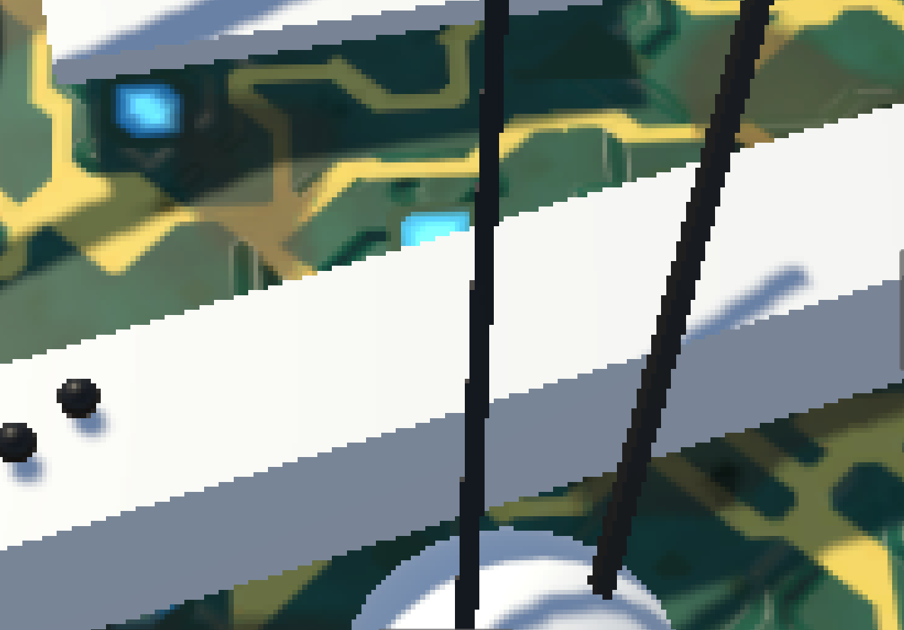
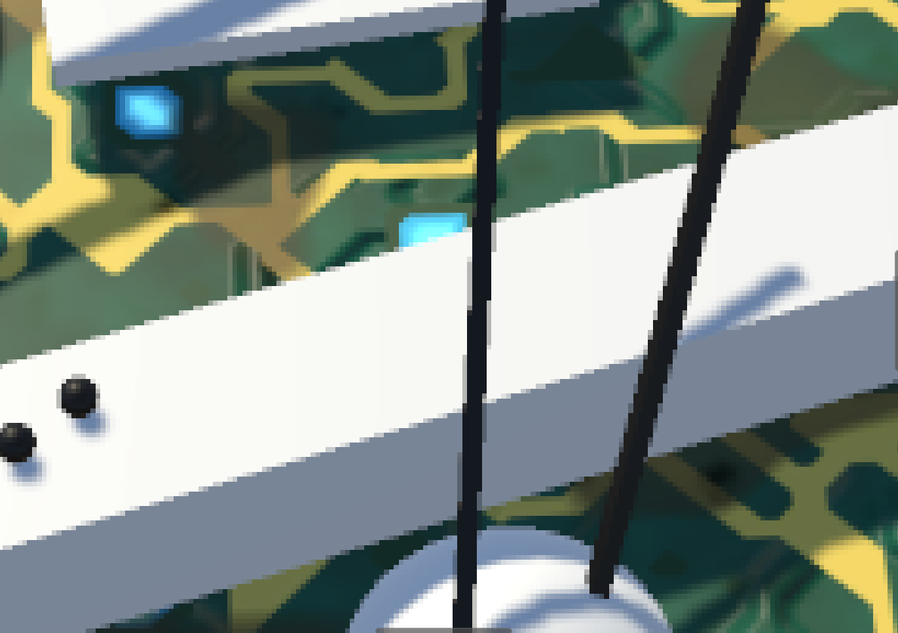
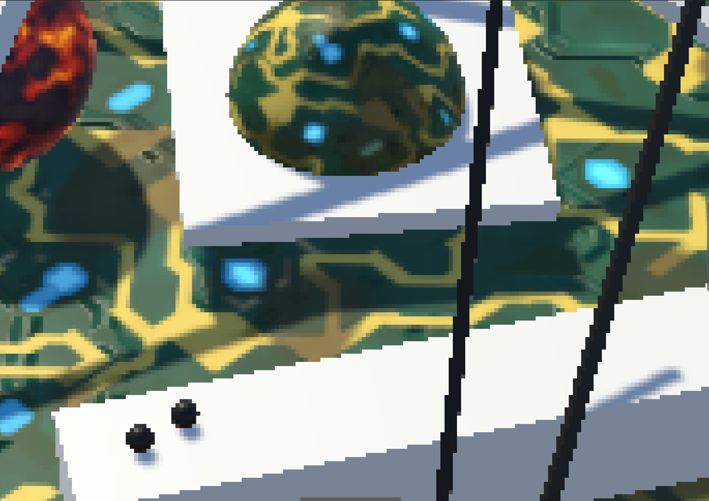
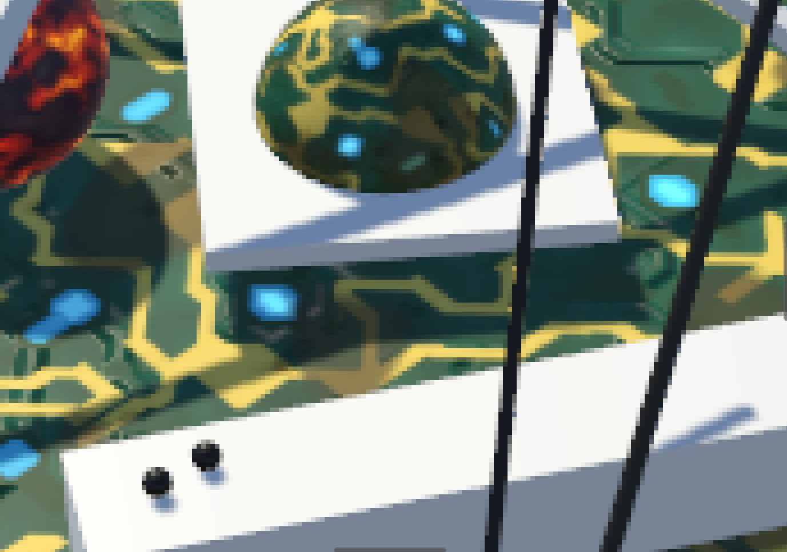
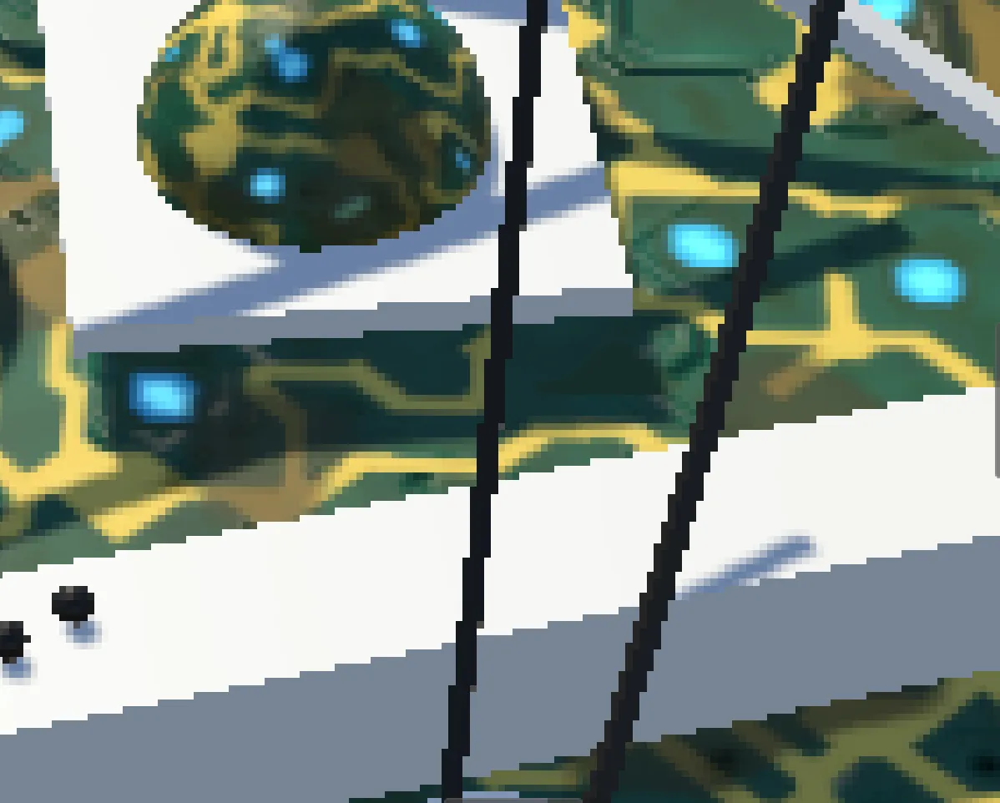
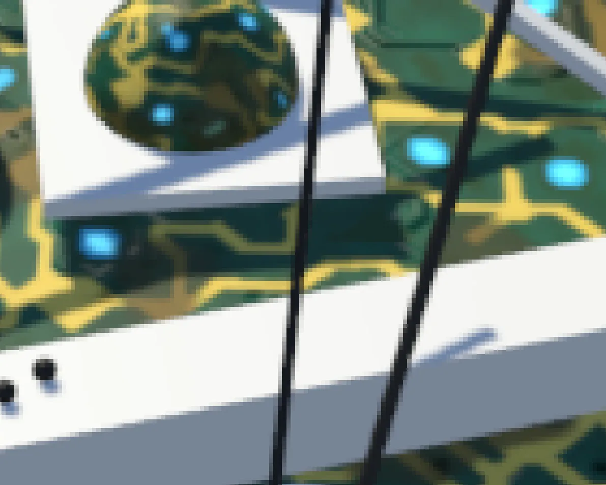
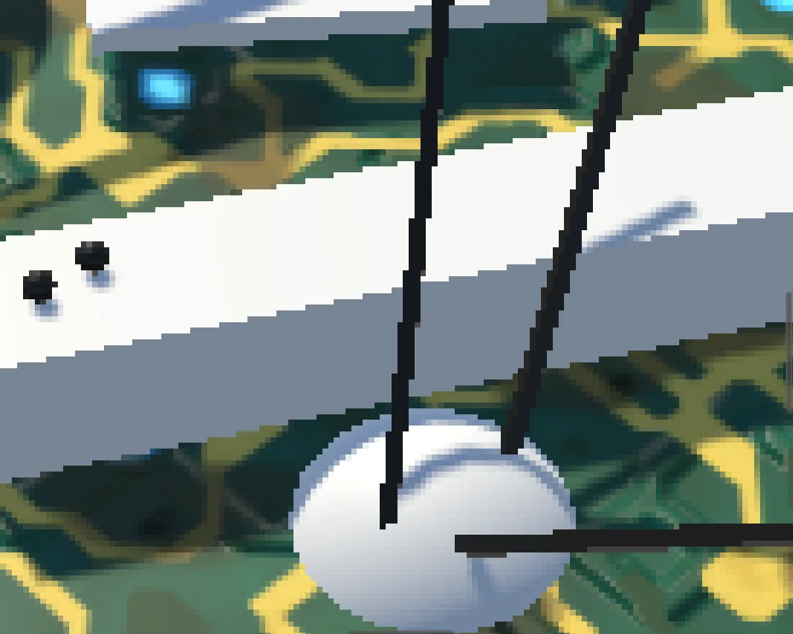
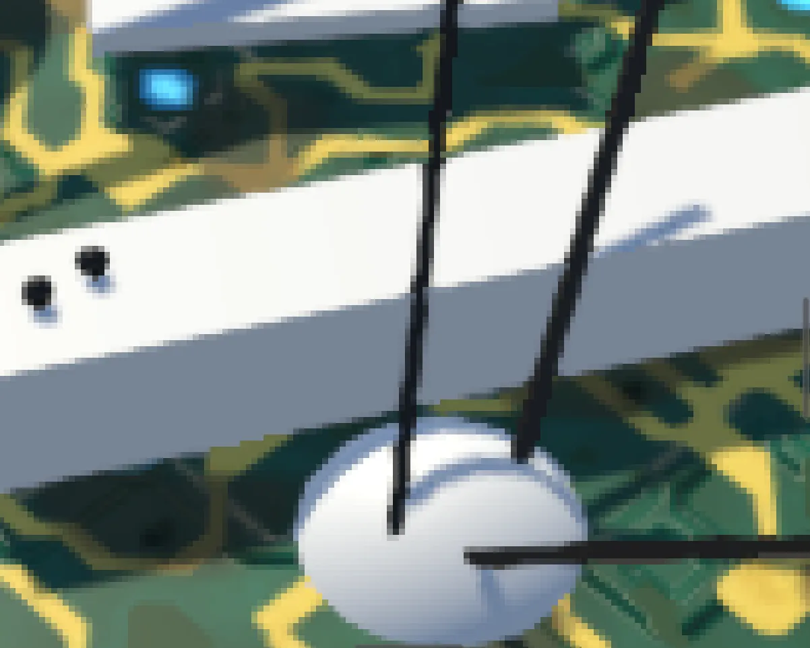
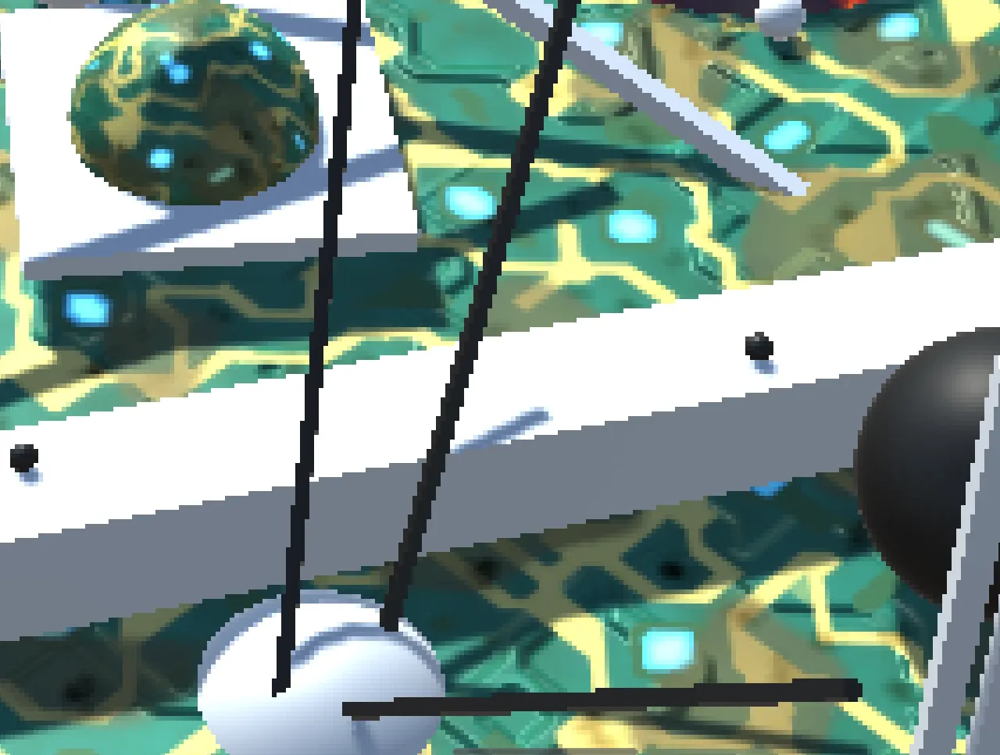

#

反走样相关方法的Unity实现，包括：

1) SSAA（Super Sampling Anti-Aliasing，超采样抗锯齿）
2) MSAA（Multi Sampling Anti-Alising，多重采样抗锯齿）
3) TAA（Temporary Anti-Alising，时间抗锯齿）
4) SMAA（ Subpixel Morphological Anti-Aliasing，次像素形态抗锯齿）

Unity implementation of anti-aliasing related methods, including:

1) SSAA (Super Sampling Anti-Aliasing)
2) MSAA (Multi Sampling Anti-Aliasing)
3) TAA (Temporary Anti-Aliasing)
4) SMAA (Subpixel Morphological Anti-Aliasing)

Unity version：2022.3.40f1c1

|||
|:---:|:---:|
|No SSAA|SSAA|

|||
|:---:|:---:|
|No MSAA|MSAA8x|

|||
|:---:|:---:|
|No TAA|TAA|

||||
|:---:|:---:|:---:|
|No FXAA|FXAA Quality|FXAA Console|

|||
|:---:|:---:|
|No SMAA|SMAA|
